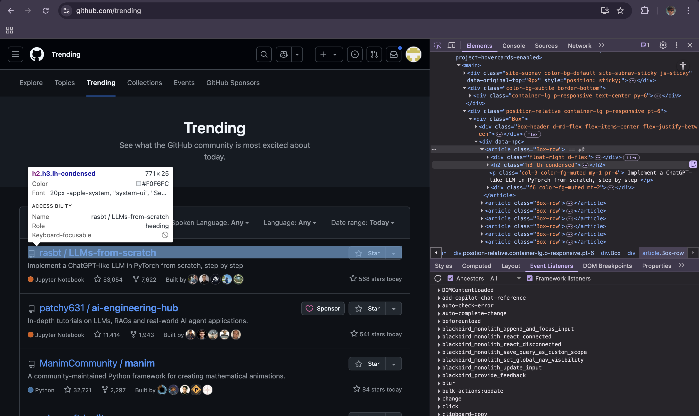

# Web Scrapper Safari

A minimal web scraping script by **Ramcharan Polabathina** that fetches the top 5 trending repositories from GitHub and saves their names and links to a CSV file.

---

1. **Inspected the HTML Structure**  
   I first opened [GitHub Trending](https://github.com/trending) and used browser dev tools to inspect the structure. The trending repository data was located inside:
   
    
   

   - `<article>` tags
   - Containing nested `<h2>` or `<h3>` headers
   - And finally, the actual repo name inside `<a>` tags

2. **Fetched the Page with `requests`**  
   I used Python's `requests` library to send a GET request and fetch the raw HTML.

3. **Parsed the Markup with BeautifulSoup**  
   With `BeautifulSoup`, I parsed the HTML and selected only the top 5 `<a>` tags inside `article h2` using the CSS selector.

4. **Cleaned the Text Content**  
   The repo names sometimes had line breaks or extra spaces. I normalized them using:
   ```python
   ' '.join(repo.text.split())
5. **Selected the Top 5 Repositories**  
   After extracting all repository links, I sliced the list to keep only the top 5 using standard Python list slicing:
   ```python
   top_repos = repo_list[:5]
6. **Created a CSV File in Write Mode**  
   I created a file named `trending.csv` using Python’s built-in `open()` function in write mode:
   ```python
   with open('trending.csv', 'w', newline='') as file:
7. **Wrote Headers and Repository Data**  
   I used Python’s `csv.writer` to first write the column headers:
   ```python
   writer.writerow(['repository_name', 'repository_link'])
   